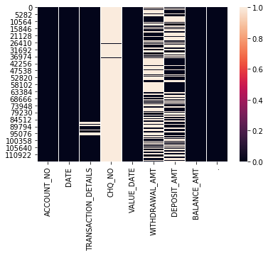
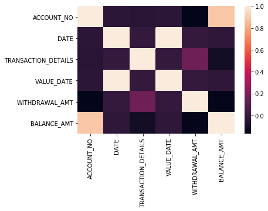
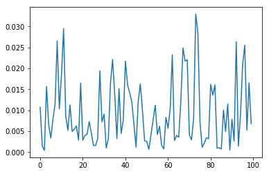
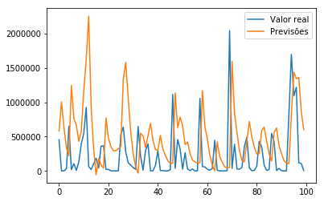

# Desafio: Predição de valores da variável Withdrawal Amount - STEFANINI

### Autor: Matheus Jericó Palhares
### e-mail: matheusjerico1994@hotmail.com
### data: 18/07/2019
### linkedIn: https://www.linkedin.com/in/matheusjerico

#### Definição do dataset:
- Account No. - representa o número da conta envolvida na transação.
- Date - data da transação.
- Transaction Details - narrações de transação em extratos bancários.
- Cheque No. - indica o número do cheque.
- Value Date - Data de conclusão da transação.
- Withdrawal Amount - Indica o montante retirado.
- Deposit Amount - Indica o valor depositado.
- Balance Amount - saldo atual da conta.

## DESAFIO: Predição de valores da variável Withdrawal Amount

#### Importando bibliotecas


```python
import pandas as pd
import matplotlib.pyplot as plt
import numpy as np
from sklearn.preprocessing import MinMaxScaler
import tensorflow as tf
import seaborn as sns
%matplotlib inline
```

#### 1. Importando dataset


```python
path_csv = '/home/matheusjerico/Documentos/IA/Desafio_LSTM/bank.csv'

dataset = pd.read_table(path_csv, sep=',')
```

    /home/matheusjerico/anaconda3/lib/python3.6/site-packages/ipykernel_launcher.py:3: FutureWarning: read_table is deprecated, use read_csv instead.
      This is separate from the ipykernel package so we can avoid doing imports until


#### 2. Pré Processamento dos dados


```python
dataset.head()
```


<div>
<style scoped>
    .dataframe tbody tr th:only-of-type {
        vertical-align: middle;
    }

    .dataframe tbody tr th {
        vertical-align: top;
    }

    .dataframe thead th {
        text-align: right;
    }
</style>
<table border="1" class="dataframe">
  <thead>
    <tr style="text-align: right;">
      <th></th>
      <th>Account No</th>
      <th>DATE</th>
      <th>TRANSACTION DETAILS</th>
      <th>CHQ.NO.</th>
      <th>VALUE DATE</th>
      <th>WITHDRAWAL AMT</th>
      <th>DEPOSIT AMT</th>
      <th>BALANCE AMT</th>
      <th>.</th>
    </tr>
  </thead>
  <tbody>
    <tr>
      <th>0</th>
      <td>409000611074'</td>
      <td>29/jun/17</td>
      <td>TRF FROM  Indiaforensic SERVICES</td>
      <td>NaN</td>
      <td>29/jun/17</td>
      <td>NaN</td>
      <td>1.000.000,00</td>
      <td>1.000.000,00</td>
      <td>.</td>
    </tr>
    <tr>
      <th>1</th>
      <td>409000611074'</td>
      <td>5/jul/17</td>
      <td>TRF FROM  Indiaforensic SERVICES</td>
      <td>NaN</td>
      <td>5/jul/17</td>
      <td>NaN</td>
      <td>1.000.000,00</td>
      <td>2.000.000,00</td>
      <td>.</td>
    </tr>
    <tr>
      <th>2</th>
      <td>409000611074'</td>
      <td>18/jul/17</td>
      <td>FDRL/INTERNAL FUND TRANSFE</td>
      <td>NaN</td>
      <td>18/jul/17</td>
      <td>NaN</td>
      <td>500.000,00</td>
      <td>2.500.000,00</td>
      <td>.</td>
    </tr>
    <tr>
      <th>3</th>
      <td>409000611074'</td>
      <td>1/ago/17</td>
      <td>TRF FRM  Indiaforensic SERVICES</td>
      <td>NaN</td>
      <td>1/ago/17</td>
      <td>NaN</td>
      <td>3.000.000,00</td>
      <td>5.500.000,00</td>
      <td>.</td>
    </tr>
    <tr>
      <th>4</th>
      <td>409000611074'</td>
      <td>16/ago/17</td>
      <td>FDRL/INTERNAL FUND TRANSFE</td>
      <td>NaN</td>
      <td>16/ago/17</td>
      <td>NaN</td>
      <td>500.000,00</td>
      <td>6.000.000,00</td>
      <td>.</td>
    </tr>
  </tbody>
</table>
</div>


```python
dataset.shape
```


    (116201, 9)


#### 2.1. Renomeando as colunas


```python
dataset = dataset.rename(columns={'Account No':'ACCOUNT_NO', 'DATE':'DATE', 'TRANSACTION DETAILS':'TRANSACTION_DETAILS',
                                'CHQ.NO.':'CHQ_NO','VALUE DATE':'VALUE_DATE',
                                ' WITHDRAWAL AMT ':'WITHDRAWAL_AMT',' DEPOSIT AMT ':'DEPOSIT_AMT',
                                'BALANCE AMT':'BALANCE_AMT', '.':'.'})
```

#### 2.2. Visualizando dados faltantes


```python
dataset.isna().sum()
```


    ACCOUNT_NO                  0
    DATE                        0
    TRANSACTION_DETAILS      2499
    CHQ_NO                 115296
    VALUE_DATE                  0
    WITHDRAWAL_AMT          62652
    DEPOSIT_AMT             53549
    BALANCE_AMT                 0
    .                           0
    dtype: int64


```python
sns.heatmap(dataset.isna())
```


    <matplotlib.axes._subplots.AxesSubplot at 0x7f746d0f0be0>





#### 2.3. Análise Exploratória


```python
# Removendo coluna insignificante
df = dataset.drop(columns=['.'])
```


```python
df.head(2)
```


<div>
<style scoped>
    .dataframe tbody tr th:only-of-type {
        vertical-align: middle;
    }

    .dataframe tbody tr th {
        vertical-align: top;
    }

    .dataframe thead th {
        text-align: right;
    }
</style>
<table border="1" class="dataframe">
  <thead>
    <tr style="text-align: right;">
      <th></th>
      <th>ACCOUNT_NO</th>
      <th>DATE</th>
      <th>TRANSACTION_DETAILS</th>
      <th>CHQ_NO</th>
      <th>VALUE_DATE</th>
      <th>WITHDRAWAL_AMT</th>
      <th>DEPOSIT_AMT</th>
      <th>BALANCE_AMT</th>
    </tr>
  </thead>
  <tbody>
    <tr>
      <th>0</th>
      <td>409000611074'</td>
      <td>29/jun/17</td>
      <td>TRF FROM  Indiaforensic SERVICES</td>
      <td>NaN</td>
      <td>29/jun/17</td>
      <td>NaN</td>
      <td>1.000.000,00</td>
      <td>1.000.000,00</td>
    </tr>
    <tr>
      <th>1</th>
      <td>409000611074'</td>
      <td>5/jul/17</td>
      <td>TRF FROM  Indiaforensic SERVICES</td>
      <td>NaN</td>
      <td>5/jul/17</td>
      <td>NaN</td>
      <td>1.000.000,00</td>
      <td>2.000.000,00</td>
    </tr>
  </tbody>
</table>
</div>


#### 2.3.1 Alterando valores numéricos em formato string para formato float

- Os valores das colunas WITHDRAWAL_AMT, DEPOSIT_AMT e BALANCE_AMT estão como string e com 'espaço' no início e no final.
- Dessa forma, vou remover os 'espaços' antes e depois do número em formato string.
- Vou retirar os 'pontos' dos dígitos e substituir a 'vírgula' por 'ponto'
- Transformar em float


```python
df['WITHDRAWAL_AMT'] =df['WITHDRAWAL_AMT'].replace('\.','',regex=True).replace(',','.', regex=True).astype(float)
df['DEPOSIT_AMT'] =df['DEPOSIT_AMT'].replace('\.','',regex=True).replace(',','.', regex=True).astype(float)
df['BALANCE_AMT'] =df['BALANCE_AMT'].replace('\.','',regex=True).replace(',','.', regex=True).astype(float)

```


```python
df.info()
```

    <class 'pandas.core.frame.DataFrame'>
    RangeIndex: 116201 entries, 0 to 116200
    Data columns (total 8 columns):
    ACCOUNT_NO             116201 non-null object
    DATE                   116201 non-null object
    TRANSACTION_DETAILS    113702 non-null object
    CHQ_NO                 905 non-null float64
    VALUE_DATE             116201 non-null object
    WITHDRAWAL_AMT         53549 non-null float64
    DEPOSIT_AMT            62652 non-null float64
    BALANCE_AMT            116201 non-null float64
    dtypes: float64(4), object(4)
    memory usage: 7.1+ MB


Visualizando o cabeçalho com a modificação


```python
df.head(3)
```


<div>
<style scoped>
    .dataframe tbody tr th:only-of-type {
        vertical-align: middle;
    }

    .dataframe tbody tr th {
        vertical-align: top;
    }

    .dataframe thead th {
        text-align: right;
    }
</style>
<table border="1" class="dataframe">
  <thead>
    <tr style="text-align: right;">
      <th></th>
      <th>ACCOUNT_NO</th>
      <th>DATE</th>
      <th>TRANSACTION_DETAILS</th>
      <th>CHQ_NO</th>
      <th>VALUE_DATE</th>
      <th>WITHDRAWAL_AMT</th>
      <th>DEPOSIT_AMT</th>
      <th>BALANCE_AMT</th>
    </tr>
  </thead>
  <tbody>
    <tr>
      <th>0</th>
      <td>409000611074'</td>
      <td>29/jun/17</td>
      <td>TRF FROM  Indiaforensic SERVICES</td>
      <td>NaN</td>
      <td>29/jun/17</td>
      <td>NaN</td>
      <td>1000000.0</td>
      <td>1000000.0</td>
    </tr>
    <tr>
      <th>1</th>
      <td>409000611074'</td>
      <td>5/jul/17</td>
      <td>TRF FROM  Indiaforensic SERVICES</td>
      <td>NaN</td>
      <td>5/jul/17</td>
      <td>NaN</td>
      <td>1000000.0</td>
      <td>2000000.0</td>
    </tr>
    <tr>
      <th>2</th>
      <td>409000611074'</td>
      <td>18/jul/17</td>
      <td>FDRL/INTERNAL FUND TRANSFE</td>
      <td>NaN</td>
      <td>18/jul/17</td>
      <td>NaN</td>
      <td>500000.0</td>
      <td>2500000.0</td>
    </tr>
  </tbody>
</table>
</div>


#### 2.3.2 Limpando colunas
- Alterando valores NaN da coluna TRANSACTION_DETAILS por 'blank' para futuro encoder;
- Remover valores NaN da coluna WITHDRAWAL_AMT (preditor);
- Remover colunas do CHQ_NO (muitos valores em branco) e DEPOSIT_AMT (não ocorre quando ocorre WITHDRAWAL_AMT .


```python
df.TRANSACTION_DETAILS = df.TRANSACTION_DETAILS.fillna('blank')
df = df.dropna(subset=['WITHDRAWAL_AMT'])
df = df.drop(columns=['DEPOSIT_AMT', 'CHQ_NO'])
```

#### 2.3.3 Alterando os valores das datas para posterior categorização utilizando dia e mês
- A análise é para descobrir se existe alguma correlação entre o WITHDRAWAL com o dia e mês
- Sabe ser as transações tem um padrão mensal.


```python
df.DATE = df.DATE.str[:-3]
df.VALUE_DATE = df.VALUE_DATE.str[:-3]
```


```python
df.head(3)
```


<div>
<style scoped>
    .dataframe tbody tr th:only-of-type {
        vertical-align: middle;
    }

    .dataframe tbody tr th {
        vertical-align: top;
    }

    .dataframe thead th {
        text-align: right;
    }
</style>
<table border="1" class="dataframe">
  <thead>
    <tr style="text-align: right;">
      <th></th>
      <th>ACCOUNT_NO</th>
      <th>DATE</th>
      <th>TRANSACTION_DETAILS</th>
      <th>VALUE_DATE</th>
      <th>WITHDRAWAL_AMT</th>
      <th>BALANCE_AMT</th>
    </tr>
  </thead>
  <tbody>
    <tr>
      <th>10</th>
      <td>409000611074'</td>
      <td>16/ago</td>
      <td>INDO GIBL Indiaforensic STL01071</td>
      <td>16/ago</td>
      <td>133900.0</td>
      <td>8366100.0</td>
    </tr>
    <tr>
      <th>11</th>
      <td>409000611074'</td>
      <td>16/ago</td>
      <td>INDO GIBL Indiaforensic STL02071</td>
      <td>16/ago</td>
      <td>18000.0</td>
      <td>8348100.0</td>
    </tr>
    <tr>
      <th>12</th>
      <td>409000611074'</td>
      <td>16/ago</td>
      <td>INDO GIBL Indiaforensic STL03071</td>
      <td>16/ago</td>
      <td>5000.0</td>
      <td>8343100.0</td>
    </tr>
  </tbody>
</table>
</div>


#### 2.3.4 Manipulando a variável TRANSACTION_DETAILS
- Extrair apenas as 4 primeiras letras da TRANSACTION_DETAILS para decobrir futura correlação


```python
df.TRANSACTION_DETAILS = df.TRANSACTION_DETAILS.str[:4]
```

Visualizar quantidades unicas de cada coluna com valores em formato string


```python
print(len(df.ACCOUNT_NO.unique()))
print(len(df.DATE.unique()))
print(len(df.TRANSACTION_DETAILS.unique()))
print(len(df.VALUE_DATE.unique()))
```

    10
    364
    455
    363


#### 2.3.5 Categorizando as colunas que possuem valores em formato string.

- Verificar se existe correlação entre as colunas e a variável TARGET (WITHDRAWAL_AMT)


```python
from sklearn.preprocessing import LabelEncoder
```


```python
le = LabelEncoder()
df.ACCOUNT_NO = le.fit_transform(df.ACCOUNT_NO)
df.DATE = le.fit_transform(df.DATE)
df.TRANSACTION_DETAILS = le.fit_transform(df.TRANSACTION_DETAILS)
df.VALUE_DATE = le.fit_transform(df.VALUE_DATE)
```

#### 2.3.6 Correlação entre variáveis.

- Verificar se existe correlação entre as colunas e a variável TARGET (WITHDRAWAL_AMT) com as demais


```python
cor = df.corr()
cor
```


<div>
<style scoped>
    .dataframe tbody tr th:only-of-type {
        vertical-align: middle;
    }

    .dataframe tbody tr th {
        vertical-align: top;
    }

    .dataframe thead th {
        text-align: right;
    }
</style>
<table border="1" class="dataframe">
  <thead>
    <tr style="text-align: right;">
      <th></th>
      <th>ACCOUNT_NO</th>
      <th>DATE</th>
      <th>TRANSACTION_DETAILS</th>
      <th>VALUE_DATE</th>
      <th>WITHDRAWAL_AMT</th>
      <th>BALANCE_AMT</th>
    </tr>
  </thead>
  <tbody>
    <tr>
      <th>ACCOUNT_NO</th>
      <td>1.000000</td>
      <td>-0.028876</td>
      <td>-0.039895</td>
      <td>-0.028963</td>
      <td>-0.165416</td>
      <td>0.886932</td>
    </tr>
    <tr>
      <th>DATE</th>
      <td>-0.028876</td>
      <td>1.000000</td>
      <td>-0.002394</td>
      <td>0.999409</td>
      <td>-0.003755</td>
      <td>-0.023285</td>
    </tr>
    <tr>
      <th>TRANSACTION_DETAILS</th>
      <td>-0.039895</td>
      <td>-0.002394</td>
      <td>1.000000</td>
      <td>-0.002393</td>
      <td>0.158852</td>
      <td>-0.107037</td>
    </tr>
    <tr>
      <th>VALUE_DATE</th>
      <td>-0.028963</td>
      <td>0.999409</td>
      <td>-0.002393</td>
      <td>1.000000</td>
      <td>-0.004276</td>
      <td>-0.023325</td>
    </tr>
    <tr>
      <th>WITHDRAWAL_AMT</th>
      <td>-0.165416</td>
      <td>-0.003755</td>
      <td>0.158852</td>
      <td>-0.004276</td>
      <td>1.000000</td>
      <td>-0.153841</td>
    </tr>
    <tr>
      <th>BALANCE_AMT</th>
      <td>0.886932</td>
      <td>-0.023285</td>
      <td>-0.107037</td>
      <td>-0.023325</td>
      <td>-0.153841</td>
      <td>1.000000</td>
    </tr>
  </tbody>
</table>
</div>


```python
sns.heatmap(df.corr())
```


    <matplotlib.axes._subplots.AxesSubplot at 0x7f746cd744e0>





Verifica-se que a correlação da variável WITHDRAWAL_AMT com as demais variaveis é muito baixa

#### 2.3.6 Removendo colunas


```python
# Removendo colunas
df = df.drop(columns=['DATE', 'VALUE_DATE', 'ACCOUNT_NO','BALANCE_AMT', 'TRANSACTION_DETAILS'])
# Resetando index
df = df.reset_index(drop=True)
```


```python
df.head()
```


<div>
<style scoped>
    .dataframe tbody tr th:only-of-type {
        vertical-align: middle;
    }

    .dataframe tbody tr th {
        vertical-align: top;
    }

    .dataframe thead th {
        text-align: right;
    }
</style>
<table border="1" class="dataframe">
  <thead>
    <tr style="text-align: right;">
      <th></th>
      <th>WITHDRAWAL_AMT</th>
    </tr>
  </thead>
  <tbody>
    <tr>
      <th>0</th>
      <td>133900.0</td>
    </tr>
    <tr>
      <th>1</th>
      <td>18000.0</td>
    </tr>
    <tr>
      <th>2</th>
      <td>5000.0</td>
    </tr>
    <tr>
      <th>3</th>
      <td>195800.0</td>
    </tr>
    <tr>
      <th>4</th>
      <td>81600.0</td>
    </tr>
  </tbody>
</table>
</div>


```python
df.info()
```

    <class 'pandas.core.frame.DataFrame'>
    RangeIndex: 53549 entries, 0 to 53548
    Data columns (total 1 columns):
    WITHDRAWAL_AMT    53549 non-null float64
    dtypes: float64(1)
    memory usage: 418.4 KB


#### 3. Tratar dos dados para implementar LSTM

#### 3.1. Definição memória (janela)
Definir a memória da LSTM, utilizando o parâmetro 'n_timesteps'. Utilizo o tamanho de 100 registros, quer dizer que para obter uma nova previsão, são utilizados 100 registros anteriores como memória. Esse é o tamanho da janela.


É necessário separar o dataset em treinamento e teste e separar cada pedaço (batch).


```python
n_timesteps = 100
```

#### 3.2 Removendo valores outliers
- Valores considerados outliers podem atrapalhar o desempho do modelo


```python
def remove_outlier(df_in, col_name):
    q1 = df_in[col_name].quantile(0.25)
    q3 = df_in[col_name].quantile(0.75)
    iqr = q3-q1 #Interquartile range
    fence_low  = q1-1.5*iqr
    fence_high = q3+1.5*iqr
    df_out = df_in.loc[(df_in[col_name] > fence_low) & (df_in[col_name] < fence_high)]
    return df_out
```


```python
print("Shape antes de remover valores outlier: {}".format(df.shape))
df = remove_outlier(df, 'WITHDRAWAL_AMT')
print("Shape após de remover valores outlier: {}".format(df.shape))

```

    Shape antes de remover valores outlier: (53549, 1)
    Shape após de remover valores outlier: (46113, 1)


```python
df.info()
```

    <class 'pandas.core.frame.DataFrame'>
    Int64Index: 46113 entries, 0 to 53548
    Data columns (total 1 columns):
    WITHDRAWAL_AMT    46113 non-null float64
    dtypes: float64(1)
    memory usage: 720.5 KB


#### 3.3 Normalizando os dados
- A LSTM é sensível a grande variação dos dados de entrada. 
- Devido a esse problema, normalizamos os dados para valores entre 0 e 1 utilizando a função MinMaxScaler.


```python
dados = np.array(df, dtype='float32')
```


```python
scaler = MinMaxScaler(feature_range=(0,1))
```


```python
dados_normalizados = scaler.fit_transform(dados)
```


```python
plt.plot(dados_normalizados[:100])
```


    [<matplotlib.lines.Line2D at 0x7f74684a3550>]





#### 3.4 Criação dos batchs e reshape dos dados para o padrão de entrada do tensorflow
O padrão de entrada do tensorflow é:
    - [tamanho_do_batch, tamanho_da_memoria (janela), qntd_atributos]
    - Em cada batch teremos 'n_timesteps' registros, no caso apresentado, 30 registros.
    
Os dados do X e do Y tem que estar deslocados em 1 unidade, por exemplo:
    - Se X vai de [0:50], Y tem que ir de [1:51] 


```python
dados_normalizados.shape
```


    (46113, 1)


```python
X = dados_normalizados[0:((len(dados_normalizados) - len(dados_normalizados) % n_timesteps)-n_timesteps)]
print("X.shape: {}".format(X.shape))
# [tamanho do batch, tamanho da janela, quantidade de entradas]
X_batch = X.reshape(-1, n_timesteps, 1)
print("X_batch.shape: {}".format(X_batch.shape))
```

    X.shape: (46000, 1)
    X_batch.shape: (460, 100, 1)


```python
Y = dados_normalizados[1:((len(dados_normalizados) - len(dados_normalizados) % n_timesteps)-(n_timesteps - 1))]
print('Y.shape: {}'.format(Y.shape))
# [tamanho do batch, tamanho da janela, quantidade de saida]
y_batch = Y.reshape(-1, n_timesteps, 1) 
print("y_batch.shape: {}".format(y_batch.shape))
```

    Y.shape: (46000, 1)
    y_batch.shape: (460, 100, 1)


#### 3.5 Criação e normalização dos dados de teste
- Da mesma forma que fiz com os dados de treino, entretanto, pego os dados finais


```python
X_teste = dados[-(n_timesteps + 1):] # 101 dados finais
X_teste = X_teste[:n_timesteps] # não pega o ultimo dado
X_teste = scaler.transform(X_teste) # normaliza
X_teste = X_teste.reshape(-1, n_timesteps, 1) # reshape para input do tensorflow

y_teste = dados[-(n_timesteps):] # 100 dados finais
y_teste = y_teste.reshape(-1, n_timesteps, 1) # reshape para input do tensorflow
                                              # o y_teste não é normalizado
```

#### 3. Algoritmo LSTM


```python
# reset grafo atual
tf.reset_default_graph()
```

#### 3.1 Parâmetros
- n_inputs: quantidade de atributos previsores. Utilizou-se apenas um parâmetro (WITHDRAWAL_AMT).
- n_nodes: quantidade de neurônios utilizados na camada ocultas. Definido após realizar alguns testes, alterando a quantidade até obter-se um bom resultado
- n_output: quantidade de atributos de saída. Para regressão, temos apenas uma saída


```python
# nº de entradas
n_input = 1
# nodes da camada do LSTM
n_nodes = 100
# nº de saídas
n_output = 1
```

#### 3.2 Definição dos placeholders que vão receber os dados


```python
# Criação dos placeholders
x = tf.placeholder(tf.float32,[None, n_timesteps, n_input])
y = tf.placeholder(tf.float32, [None, n_timesteps, n_output])
```

#### 3.3 Definição de uma célula LSTM
- Cada célula indica uma camada oculta


```python
def criar_uma_celula():
    # Função para criar uma célula LSTM
    # Parâmetros: quantidade de nodes da camada (100), função de ativação (tanh)
    
    return tf.contrib.rnn.LSTMCell(num_units = n_nodes, activation = tf.nn.tanh)
```

#### 3.4 Função para criar N células (camadas) 
- Foram criadas 3 celúlas LSTM com Dropout.
- O uso de mais de uma célula pode melhorar os resultados.
- A camada de Dropout evita o overfitting do modelo.


```python
def crias_varias_celulas(n_celulas):
    # Inicializo várias células
    celulas = tf.nn.rnn_cell.MultiRNNCell([criar_uma_celula() for i in range(0, n_celulas)])
    # Coloco droupout com valor de 0.1 
    return tf.contrib.rnn.DropoutWrapper(celulas, input_keep_prob= 0.9) # dropout
```

#### 3.5 Criando células ocultas e célula de saída
- Criação de 3 células e 1 camada de saída;
- Como tem 100 neurônios na camada oculta, preciso transformar em apenas um output (output_size = 1)


```python
# Criando 3 células
celula = crias_varias_celulas(3)
# Criação da camada de saída,
# Apenas uma saída, pois queremos predizer apenas um parâmetro
celula = tf.contrib.rnn.OutputProjectionWrapper(celula, output_size= n_output)
```

    
    WARNING: The TensorFlow contrib module will not be included in TensorFlow 2.0.
    For more information, please see:
      * https://github.com/tensorflow/community/blob/master/rfcs/20180907-contrib-sunset.md
      * https://github.com/tensorflow/addons
    If you depend on functionality not listed there, please file an issue.
    
    WARNING:tensorflow:From <ipython-input-40-40bbab6be74d>:5: LSTMCell.__init__ (from tensorflow.python.ops.rnn_cell_impl) is deprecated and will be removed in a future version.
    Instructions for updating:
    This class is equivalent as tf.keras.layers.LSTMCell, and will be replaced by that in Tensorflow 2.0.
    WARNING:tensorflow:From <ipython-input-41-4e2cacb75cdc>:3: MultiRNNCell.__init__ (from tensorflow.python.ops.rnn_cell_impl) is deprecated and will be removed in a future version.
    Instructions for updating:
    This class is equivalent as tf.keras.layers.StackedRNNCells, and will be replaced by that in Tensorflow 2.0.


#### 3.6 Criação da LSTM
- É necessário ter a saída da LSTM para calcular o erro, e posteriormente otimizar o erro das previsões.
- saida_lstm é a saída da RN, as predições


```python
saida_lstm,_ = tf.nn.dynamic_rnn(celula, x, dtype=tf.float32)
```

    WARNING:tensorflow:From <ipython-input-43-dc35708a6001>:1: dynamic_rnn (from tensorflow.python.ops.rnn) is deprecated and will be removed in a future version.
    Instructions for updating:
    Please use `keras.layers.RNN(cell)`, which is equivalent to this API
    WARNING:tensorflow:From /home/matheusjerico/anaconda3/lib/python3.6/site-packages/tensorflow/python/ops/tensor_array_ops.py:162: colocate_with (from tensorflow.python.framework.ops) is deprecated and will be removed in a future version.
    Instructions for updating:
    Colocations handled automatically by placer.
    WARNING:tensorflow:From /home/matheusjerico/anaconda3/lib/python3.6/site-packages/tensorflow/python/ops/rnn_cell_impl.py:1259: calling dropout (from tensorflow.python.ops.nn_ops) with keep_prob is deprecated and will be removed in a future version.
    Instructions for updating:
    Please use `rate` instead of `keep_prob`. Rate should be set to `rate = 1 - keep_prob`.


#### 3.7 Erros e métricas:
- Função para cálculo do erro: mean_squared_error.
- Otimizador: AdamOptimizer

O otimizador mais adequado, depois de vários testes, foi o Adam com learning rate = 0.001 (valor default). A função de erro escolhida foi a MSE.


```python
# Função para o cálculo do erro
# Parâmetros: o labels e as predições 
erro = tf.losses.mean_squared_error(labels=y, predictions=saida_lstm)
# Otimizador
otimizador = tf.train.AdamOptimizer()
# Treinamento, o objetivo é minimizar o erro
treinamento = otimizador.minimize(erro)
```

    WARNING:tensorflow:From /home/matheusjerico/anaconda3/lib/python3.6/site-packages/tensorflow/python/ops/losses/losses_impl.py:667: to_float (from tensorflow.python.ops.math_ops) is deprecated and will be removed in a future version.
    Instructions for updating:
    Use tf.cast instead.


#### 3.8 Inicializando variáveis globais


```python
init = tf.global_variables_initializer()
```

#### 3.9 Definição da quantidade de épocas


```python
epocas = 1000
# Definição de quando mostrar as métricas
n_display = epocas/10
```

#### 4.0 Iniciando sessão do TensorFlow
- Inicializa variáveis;
- Loop de treinamento com duração das epocas definidas acima;
- Rodar treinamento da rede:
    - parâmetros: otimizador do erro, e função para cálculo do erro
- Realizar previsão.


```python
# Inicio a sessão para treinamento e previsão
with tf.Session() as sess:
    sess.run(init)
    # Loop de épocas
    for epoca in range(epocas+1):
        # Faço o treinamento e passo os parâmetros que são utilizados nas funções 
        # 'tf.nn.dynamic_rnn' e 'tf.losses.mean_squared_error'
        _, loss = sess.run([treinamento, erro], feed_dict = {x: X_batch, y: y_batch})
        if epoca % n_display == 0:
            print('Epoca:', epoca, '\terro (MSE):', loss)
    
    # Realizando predições
    previsoes = sess.run(saida_lstm, feed_dict = {x: X_teste})
```

    Epoca: 0 	erro (MSE): 0.06963952
    Epoca: 100 	erro (MSE): 0.03580214
    Epoca: 200 	erro (MSE): 0.034357373
    Epoca: 300 	erro (MSE): 0.03370961
    Epoca: 400 	erro (MSE): 0.033230133
    Epoca: 500 	erro (MSE): 0.03251452
    Epoca: 600 	erro (MSE): 0.031731438
    Epoca: 700 	erro (MSE): 0.031318955
    Epoca: 800 	erro (MSE): 0.030713845
    Epoca: 900 	erro (MSE): 0.029616496
    Epoca: 1000 	erro (MSE): 0.028971218


#### 5. Resultados

- Variáveis estão no formato tensor flow (3 dimensões), uso método ravel para diminuir suas dimensões.


```python
y_teste_normal = np.ravel(y_teste)
print("y_teste.shape: {}".format(y_teste.shape))
print("y_teste_normal.shape: {}".format(y_teste_normal.shape))
```

    y_teste.shape: (1, 100, 1)
    y_teste_normal.shape: (100,)


```python
previsoes_normal = np.ravel(previsoes)
print("previsoes.shape: {}".format(previsoes.shape))
print("previsoes_normal.shape: {}".format(previsoes_normal.shape))
```

    previsoes.shape: (1, 100, 1)
    previsoes_normal.shape: (100,)


#### 5.1 Desnormalização das previsões
Anteriormente eu normalizei os dados de treino, dessa forma, a predição foi feita com base nos dados normalizados.
Utilizo a função 'inverse_transform' para desnormalizar.


```python
previsoes_normal = previsoes_normal.reshape(-1, 1)
print(previsoes_normal.shape)
previsoes_normal = scaler.inverse_transform(previsoes_normal) # Desnormalizando as previsões
previsoes_normal = np.squeeze(previsoes_normal) # Visualizar melhor
```

    (100, 1)


#### 5.2 Métricas 
A métrica Mean Absolute Error informa a diferença do valor real com o valor previsto, que é bom para verificar a acurácia do modelo.


```python
from sklearn.metrics import mean_absolute_error
mae = mean_absolute_error(y_teste_normal, previsoes_normal)
```


```python
def visualizar_resultados():
    for i in range(len(previsoes_normal)):
        print('Previsão:', previsoes_normal[i], '\tValor real:', y_teste_normal[i])
    print()
    print('Mean Absolute Error:', round(mae,4))
```


```python
visualizar_resultados()
```

    Previsão: 581840.75 	Valor real: 454854.66
    Previsão: 1004148.56 	Valor real: 266.0
    Previsão: 627624.9 	Valor real: 355.0
    Previsão: 336428.47 	Valor real: 33365.0
    Previsão: 221871.69 	Valor real: 652887.75
    Previsão: 1244062.6 	Valor real: 19102.92
    Previsão: 767805.5 	Valor real: 106083.61
    Previsão: 665653.0 	Valor real: 9000.0
    Previsão: 431947.66 	Valor real: 131275.03
    Previsão: 574918.9 	Valor real: 392245.28
    Previsão: 1165062.2 	Valor real: 547040.5
    Previsão: 1623897.5 	Valor real: 925515.0
    Previsão: 2254961.8 	Valor real: 62961.77
    Previsão: 928803.2 	Valor real: 21390.0
    Previsão: 327343.12 	Valor real: 103272.41
    Previsão: -54530.41 	Valor real: 186082.95
    Previsão: 181376.06 	Valor real: 42329.46
    Previsão: 85985.41 	Valor real: 359575.28
    Previsão: 38960.582 	Valor real: 365031.56
    Previsão: 772772.3 	Valor real: 22213.0
    Previsão: 473764.22 	Valor real: 22563.0
    Previsão: 355036.12 	Valor real: 1373.0
    Previsão: 292854.66 	Valor real: 697.0
    Previsão: 294523.1 	Valor real: 176.0
    Previsão: 323304.22 	Valor real: 807.0
    Previsão: 356566.12 	Valor real: 533164.0
    Previsão: 1342050.0 	Valor real: 637910.25
    Previsão: 1582795.4 	Valor real: 274440.56
    Previsão: 1056433.1 	Valor real: 117391.52
    Previsão: 572163.6 	Valor real: 86142.4
    Previsão: 252625.14 	Valor real: 48479.0
    Previsão: 59210.574 	Valor real: 22898.11
    Previsão: -32227.338 	Valor real: 648567.7
    Previsão: 549701.1 	Valor real: 213872.66
    Previsão: 509664.16 	Valor real: 9600.0
    Previsão: 346576.28 	Valor real: 297216.8
    Previsão: 515049.5 	Valor real: 393770.6
    Previsão: 693655.5 	Valor real: 2238.0
    Previsão: 446323.2 	Valor real: 1273.0
    Previsão: 311414.1 	Valor real: 79019.0
    Previsão: 300229.6 	Valor real: 293305.0
    Previsão: 516962.44 	Valor real: 5362.0
    Previsão: 320739.0 	Valor real: 4948.0
    Previsão: 228518.89 	Valor real: 558.0
    Previsão: 150173.03 	Valor real: 1592.0
    Previsão: 112189.23 	Valor real: 16049.0
    Previsão: 110059.72 	Valor real: 1113230.0
    Previsão: 1137084.4 	Valor real: 37159.0
    Previsão: 631236.1 	Valor real: 458277.03
    Previsão: 784610.2 	Valor real: 317498.0
    Previsão: 657210.1 	Valor real: 27000.0
    Previsão: 384624.6 	Valor real: 264434.47
    Previsão: 422305.0 	Valor real: 28210.66
    Previsão: 253334.56 	Valor real: 4106.0
    Previsão: 157111.89 	Valor real: 28825.0
    Previsão: 134698.28 	Valor real: 19.0
    Previsão: 112988.05 	Valor real: 1371.0
    Previsão: 119048.7 	Valor real: 1057023.0
    Previsão: 1171805.6 	Valor real: 63519.84
    Previsão: 647648.9 	Valor real: 59322.7
    Previsão: 467921.8 	Valor real: 25953.71
    Previsão: 229850.38 	Valor real: 10000.0
    Previsão: 88131.836 	Valor real: 33245.55
    Previsão: 188.06358 	Valor real: 447689.53
    Previsão: 424600.62 	Valor real: 9864.0
    Previsão: 208836.67 	Valor real: 1868.0
    Previsão: 127194.48 	Valor real: 492.0
    Previsão: 62174.56 	Valor real: 305.0
    Previsão: 44470.477 	Valor real: 1843.0
    Previsão: 50511.17 	Valor real: 2046017.0
    Previsão: 1596193.6 	Valor real: 36109.9
    Previsão: 838006.25 	Valor real: 388948.62
    Previsão: 557784.9 	Valor real: 27858.93
    Previsão: 296241.62 	Valor real: 25150.0
    Previsão: 150524.38 	Valor real: 49089.22
    Previsão: 134050.0 	Valor real: 360211.1
    Previsão: 444259.25 	Valor real: 490955.2
    Previsão: 720645.0 	Valor real: 44337.78
    Previsão: 495172.3 	Valor real: 4000.0
    Previsão: 348806.53 	Valor real: 8902.39
    Previsão: 247191.55 	Valor real: 67752.22
    Previsão: 251483.97 	Valor real: 431613.75
    Previsão: 595254.3 	Valor real: 348262.4
    Previsão: 638327.3 	Valor real: 83802.03
    Previsão: 434476.2 	Valor real: 8000.0
    Previsão: 246632.28 	Valor real: 20185.23
    Previsão: 143043.0 	Valor real: 548691.0
    Previsão: 557520.75 	Valor real: 425622.38
    Previsão: 626403.6 	Valor real: 6599.0
    Previsão: 367466.4 	Valor real: 37251.0
    Previsão: 252410.72 	Valor real: 2829.0
    Previsão: 151948.61 	Valor real: 98.0
    Previsão: 113736.234 	Valor real: 230.0
    Previsão: 107714.04 	Valor real: 816832.0
    Previsão: 824136.9 	Valor real: 1699952.1
    Previsão: 1441470.5 	Valor real: 1095668.9
    Previsão: 1346229.5 	Valor real: 1218673.0
    Previsão: 1362091.6 	Valor real: 117934.3
    Previsão: 868197.56 	Valor real: 109868.65
    Previsão: 602036.0 	Valor real: 5000.0
    
    Mean Absolute Error: 461451.72


```python
plt.plot(y_teste_normal, label = 'Valor real')
plt.plot(previsoes_normal, label = 'Previsões')
plt.legend()
```


    <matplotlib.legend.Legend at 0x7f74447cd128>




---
---
---

# Desafio: Predição de clientes bons - STEFANINI

### Autor: Matheus Jericó Palhares
### e-mail: matheusjerico1994@hotmail.com
### data: 18/07/2019

#### Definição do dataset:
- Account No. - representa o número da conta envolvida na transação.
- Date - data da transação.
- Transaction Details - narrações de transação em extratos bancários.
- Cheque No. - indica o número do cheque.
- Value Date - Data de conclusão da transação.
- Withdrawal Amount - Indica o montante retirado.
- Deposit Amount - Indica o valor depositado.
- Balance Amount - saldo atual da conta.

#### Importando bibliotecas


```python
import pandas as pd
import matplotlib.pyplot as plt
import numpy as np
from sklearn.preprocessing import MinMaxScaler
import tensorflow as tf
import seaborn as sns
%matplotlib inline
```

#### 1. Importando dataset


```python
path_xlsx = '/home/matheusjerico/Documentos/IA/Desafio_LSTM/bank.xlsx'

dataset = pd.read_excel(path_xlsx, sep=',')
```

#### 2. Pré Processamento dos dados


```python
dataset.head()
```


<div>
<style scoped>
    .dataframe tbody tr th:only-of-type {
        vertical-align: middle;
    }

    .dataframe tbody tr th {
        vertical-align: top;
    }

    .dataframe thead th {
        text-align: right;
    }
</style>
<table border="1" class="dataframe">
  <thead>
    <tr style="text-align: right;">
      <th></th>
      <th>Account No</th>
      <th>DATE</th>
      <th>TRANSACTION DETAILS</th>
      <th>CHQ.NO.</th>
      <th>VALUE DATE</th>
      <th>WITHDRAWAL AMT</th>
      <th>DEPOSIT AMT</th>
      <th>BALANCE AMT</th>
      <th>.</th>
    </tr>
  </thead>
  <tbody>
    <tr>
      <th>0</th>
      <td>409000611074'</td>
      <td>2017-06-29</td>
      <td>TRF FROM  Indiaforensic SERVICES</td>
      <td>NaN</td>
      <td>2017-06-29</td>
      <td>NaN</td>
      <td>1000000.0</td>
      <td>1000000.0</td>
      <td>.</td>
    </tr>
    <tr>
      <th>1</th>
      <td>409000611074'</td>
      <td>2017-07-05</td>
      <td>TRF FROM  Indiaforensic SERVICES</td>
      <td>NaN</td>
      <td>2017-07-05</td>
      <td>NaN</td>
      <td>1000000.0</td>
      <td>2000000.0</td>
      <td>.</td>
    </tr>
    <tr>
      <th>2</th>
      <td>409000611074'</td>
      <td>2017-07-18</td>
      <td>FDRL/INTERNAL FUND TRANSFE</td>
      <td>NaN</td>
      <td>2017-07-18</td>
      <td>NaN</td>
      <td>500000.0</td>
      <td>2500000.0</td>
      <td>.</td>
    </tr>
    <tr>
      <th>3</th>
      <td>409000611074'</td>
      <td>2017-08-01</td>
      <td>TRF FRM  Indiaforensic SERVICES</td>
      <td>NaN</td>
      <td>2017-08-01</td>
      <td>NaN</td>
      <td>3000000.0</td>
      <td>5500000.0</td>
      <td>.</td>
    </tr>
    <tr>
      <th>4</th>
      <td>409000611074'</td>
      <td>2017-08-16</td>
      <td>FDRL/INTERNAL FUND TRANSFE</td>
      <td>NaN</td>
      <td>2017-08-16</td>
      <td>NaN</td>
      <td>500000.0</td>
      <td>6000000.0</td>
      <td>.</td>
    </tr>
  </tbody>
</table>
</div>


```python
dataset.shape
```


    (116201, 9)


#### 2.1. Renomeando as colunas


```python
dataset = dataset.rename(columns={'Account No':'ACCOUNT_NO', 'DATE':'DATE', 'TRANSACTION DETAILS':'TRANSACTION_DETAILS',
                                'CHQ.NO.':'CHQ_NO','VALUE DATE':'VALUE_DATE',
                                'WITHDRAWAL AMT':'WITHDRAWAL_AMT','DEPOSIT AMT':'DEPOSIT_AMT',
                                'BALANCE AMT':'BALANCE_AMT', '.':'.'})
```

#### 2.2. Visualizando dados faltantes e removendo colunas desnecessárias


```python
dataset.isna().sum()
```


    ACCOUNT_NO                  0
    DATE                        0
    TRANSACTION_DETAILS      2499
    CHQ_NO                 115296
    VALUE_DATE                  0
    WITHDRAWAL_AMT          62652
    DEPOSIT_AMT             53549
    BALANCE_AMT                 0
    .                           0
    dtype: int64


```python
sns.heatmap(dataset.isna())
```


    <matplotlib.axes._subplots.AxesSubplot at 0x7ff0b21e8668>


# 1. Segunda Tarefa - Desafio LSTM

### Verificar em os pontos de melhores clientes

#### 1.1. Pré Processamento

- Remover coluna com muitos valores NaN


```python
df = dataset.drop(columns=['CHQ_NO'])
```

- Removendo as colunas date, value_date, transaction_details, balance_amt e '.'


```python
df = df.drop(columns=['DATE', 'VALUE_DATE','TRANSACTION_DETAILS','.','BALANCE_AMT'])
```

#### 1.2 Preenchimento de valores NaN
- As colunas WITHDRAWAL_AMT e DEPOSIT_AMT são opostas, quando uma tem valor, a outra não tem.
- Isso ocorre porque nosso dataset é referente transações bancárias. Logo, uma transação de saque não ocorre junto a de depósito.
- Para isso, vamos substituir os valores NaN por 0.


```python
df['WITHDRAWAL_AMT'] = df['WITHDRAWAL_AMT'].fillna(0)
df['DEPOSIT_AMT'] = df['DEPOSIT_AMT'].fillna(0)
```

- Verificar a existência de valores NaN no novo dataset e obtendo informações referentes ao dataset


```python
df.isna().sum()
```


    ACCOUNT_NO        0
    WITHDRAWAL_AMT    0
    DEPOSIT_AMT       0
    dtype: int64


```python
df.info()
```

    <class 'pandas.core.frame.DataFrame'>
    RangeIndex: 116201 entries, 0 to 116200
    Data columns (total 3 columns):
    ACCOUNT_NO        116201 non-null object
    WITHDRAWAL_AMT    116201 non-null float64
    DEPOSIT_AMT       116201 non-null float64
    dtypes: float64(2), object(1)
    memory usage: 2.7+ MB


```python
df.head(3)
```


<div>
<style scoped>
    .dataframe tbody tr th:only-of-type {
        vertical-align: middle;
    }

    .dataframe tbody tr th {
        vertical-align: top;
    }

    .dataframe thead th {
        text-align: right;
    }
</style>
<table border="1" class="dataframe">
  <thead>
    <tr style="text-align: right;">
      <th></th>
      <th>ACCOUNT_NO</th>
      <th>WITHDRAWAL_AMT</th>
      <th>DEPOSIT_AMT</th>
    </tr>
  </thead>
  <tbody>
    <tr>
      <th>0</th>
      <td>409000611074'</td>
      <td>0.0</td>
      <td>1000000.0</td>
    </tr>
    <tr>
      <th>1</th>
      <td>409000611074'</td>
      <td>0.0</td>
      <td>1000000.0</td>
    </tr>
    <tr>
      <th>2</th>
      <td>409000611074'</td>
      <td>0.0</td>
      <td>500000.0</td>
    </tr>
  </tbody>
</table>
</div>


#### 1.3 Categorizando as colunas que possuem valores em formato string.


```python
from sklearn.preprocessing import LabelEncoder
```


```python
df.ACCOUNT_NO = df.ACCOUNT_NO.astype('category')
le = LabelEncoder()
df.ACCOUNT_NO = le.fit_transform(df.ACCOUNT_NO)
```

- Visualizando correlação entre variáveis


```python
df.corr()
```


<div>
<style scoped>
    .dataframe tbody tr th:only-of-type {
        vertical-align: middle;
    }

    .dataframe tbody tr th {
        vertical-align: top;
    }

    .dataframe thead th {
        text-align: right;
    }
</style>
<table border="1" class="dataframe">
  <thead>
    <tr style="text-align: right;">
      <th></th>
      <th>ACCOUNT_NO</th>
      <th>WITHDRAWAL_AMT</th>
      <th>DEPOSIT_AMT</th>
    </tr>
  </thead>
  <tbody>
    <tr>
      <th>ACCOUNT_NO</th>
      <td>1.000000</td>
      <td>-0.051821</td>
      <td>-0.059683</td>
    </tr>
    <tr>
      <th>WITHDRAWAL_AMT</th>
      <td>-0.051821</td>
      <td>1.000000</td>
      <td>-0.082927</td>
    </tr>
    <tr>
      <th>DEPOSIT_AMT</th>
      <td>-0.059683</td>
      <td>-0.082927</td>
      <td>1.000000</td>
    </tr>
  </tbody>
</table>
</div>


- Verificar a formato dataset e obtendo informações referentes ao dataset


```python
print(df.shape)
```

    (116201, 3)


```python
df.info()
```

    <class 'pandas.core.frame.DataFrame'>
    RangeIndex: 116201 entries, 0 to 116200
    Data columns (total 3 columns):
    ACCOUNT_NO        116201 non-null int64
    WITHDRAWAL_AMT    116201 non-null float64
    DEPOSIT_AMT       116201 non-null float64
    dtypes: float64(2), int64(1)
    memory usage: 2.7 MB


#### 1.4 Criando nova columa com saldo do cada número de conta
- Para isso, criei uma nova coluna chamada 'account_balance_positive' para fazer a somatória dos valores depositados por cada conta, de forma acumulativa.
- Criei uma nova coluna chamada 'account_balance_negative' para fazer a somatória dos valores retirados por cada conta, de forma acumulativa.
- Caso uma conta faça o depósito de R$1000,00 5 vezes, o valor da 'account_balance_positive' vai ser acumulativo.
- Após a criação das duas colunas, faço a subtração entre a coluna 'account_balance_positive' com a 'account_balance_negative', obtendo o saldo atual de cada conta após cada transação, uma nova coluna chamada 'account_balance_total'
- Esse novo parâmetro será utilizado para calcular o potencial dos clientes.


```python
# Inicializo as colunas
df['account_balance_positive'] = 0
df['account_balance_negative'] = 0
df['account_balance_total'] = 0
```


```python
# Calculando os valores positivos por cada conta:
df['account_balance_positive'] = df.groupby(['ACCOUNT_NO'])['DEPOSIT_AMT'].cumsum()
```


```python
# Calculando os valores retirados por cada conta:
df['account_balance_negative'] = df.groupby(['ACCOUNT_NO'])['WITHDRAWAL_AMT'].cumsum()
```


```python
# Fazendo a subtração entre as duas colunas:
df['account_balance_total'] = df['account_balance_positive'] - df['account_balance_negative']
```


```python
df.head(5)
```


<div>
<style scoped>
    .dataframe tbody tr th:only-of-type {
        vertical-align: middle;
    }

    .dataframe tbody tr th {
        vertical-align: top;
    }

    .dataframe thead th {
        text-align: right;
    }
</style>
<table border="1" class="dataframe">
  <thead>
    <tr style="text-align: right;">
      <th></th>
      <th>ACCOUNT_NO</th>
      <th>WITHDRAWAL_AMT</th>
      <th>DEPOSIT_AMT</th>
      <th>account_balance_positive</th>
      <th>account_balance_negative</th>
      <th>account_balance_total</th>
    </tr>
  </thead>
  <tbody>
    <tr>
      <th>0</th>
      <td>9</td>
      <td>0.0</td>
      <td>1000000.0</td>
      <td>1000000.0</td>
      <td>0.0</td>
      <td>1000000.0</td>
    </tr>
    <tr>
      <th>1</th>
      <td>9</td>
      <td>0.0</td>
      <td>1000000.0</td>
      <td>2000000.0</td>
      <td>0.0</td>
      <td>2000000.0</td>
    </tr>
    <tr>
      <th>2</th>
      <td>9</td>
      <td>0.0</td>
      <td>500000.0</td>
      <td>2500000.0</td>
      <td>0.0</td>
      <td>2500000.0</td>
    </tr>
    <tr>
      <th>3</th>
      <td>9</td>
      <td>0.0</td>
      <td>3000000.0</td>
      <td>5500000.0</td>
      <td>0.0</td>
      <td>5500000.0</td>
    </tr>
    <tr>
      <th>4</th>
      <td>9</td>
      <td>0.0</td>
      <td>500000.0</td>
      <td>6000000.0</td>
      <td>0.0</td>
      <td>6000000.0</td>
    </tr>
  </tbody>
</table>
</div>


- Remoção das colunas 'account_balance_positive' e 'account_balance_negative'


```python
df = df.drop(columns=['account_balance_negative', 'account_balance_positive'])
```


```python
df.head(5)
```


<div>
<style scoped>
    .dataframe tbody tr th:only-of-type {
        vertical-align: middle;
    }

    .dataframe tbody tr th {
        vertical-align: top;
    }

    .dataframe thead th {
        text-align: right;
    }
</style>
<table border="1" class="dataframe">
  <thead>
    <tr style="text-align: right;">
      <th></th>
      <th>ACCOUNT_NO</th>
      <th>WITHDRAWAL_AMT</th>
      <th>DEPOSIT_AMT</th>
      <th>account_balance_total</th>
    </tr>
  </thead>
  <tbody>
    <tr>
      <th>0</th>
      <td>9</td>
      <td>0.0</td>
      <td>1000000.0</td>
      <td>1000000.0</td>
    </tr>
    <tr>
      <th>1</th>
      <td>9</td>
      <td>0.0</td>
      <td>1000000.0</td>
      <td>2000000.0</td>
    </tr>
    <tr>
      <th>2</th>
      <td>9</td>
      <td>0.0</td>
      <td>500000.0</td>
      <td>2500000.0</td>
    </tr>
    <tr>
      <th>3</th>
      <td>9</td>
      <td>0.0</td>
      <td>3000000.0</td>
      <td>5500000.0</td>
    </tr>
    <tr>
      <th>4</th>
      <td>9</td>
      <td>0.0</td>
      <td>500000.0</td>
      <td>6000000.0</td>
    </tr>
  </tbody>
</table>
</div>


#### 1.5 Criando uma nova coluna
- Quando o valor do 'account_balance_total' é negativo, temos um potencial de um cliente que não é bom, pois está com seu dividendo ativo.
- Quando temos um valor positivo, indica que foi inserido um valor maior que retirado.
- Dessa forma, crio uma nova coluna informando se temos um bom potencial ou não.


```python
df['good_client'] = np.where(df.account_balance_total > 0, 1, 0)
```

#### 1.7 Embaralhando o dataset para retirar ordem cronológica


```python
df=df.iloc[np.random.permutation(len(df))]
```

#### 1.8 Resetando index


```python
df=df.reset_index(drop=True)
print(df.shape)
```

    (116201, 5)


#### 2. Definição da janela
Definir a janela da LSTM, utilizando o parâmetro 'n_timesteps'. 


```python
n_timesteps = 100
```

#### 2.1 Separando os dados de treino e teste
O padrão de entrada do tensorflow é:
    - [tamanho_do_batch, tamanho_da_memoria (janela), qntd_atributos]
    - Em cada batch teremos 'n_timesteps' registros, no caso apresentado, 30 registros.


```python
x_input = df.iloc[0:116000,0:4]
X_batch = np.array(x_input).reshape(-1, n_timesteps, 4)
y_input = df.iloc[0:116000,4:5]
y_batch = np.array(y_input).reshape(-1, n_timesteps, 1)


x_test = df.iloc[116000:116200,0:4]
X_teste = np.array(x_test).reshape(-1, n_timesteps, 4)
y_test = df.iloc[116000:116200,4:5]
y_teste = np.array(y_test).reshape(-1, n_timesteps, 1)
```

#### 3. Algoritmo LSTM


```python
# reset grafo atual
tf.reset_default_graph()
```

#### 3.1 Parâmetros
- n_inputs: quantidade de atributos previsores. Utilizou-se 4 parâmetros.
- n_nodes: quantidade de neurônios utilizados na camada ocultas. Definido após realizar alguns testes, alterando a quantidade até obter-se um bom resultado
- n_output: quantidade de atributos de saída. Apenas uma saída, que oscila entre 0 e 1. 1 para melhores clientes e 0 para piores clientes


```python
# nº de entradas
n_input = 4
# nodes da camada do LSTM
n_nodes = 100
# nº de saídas
n_output = 1
```

#### 3.2 Criação dos placeholders


```python
# Criação dos placeholders
x = tf.placeholder(tf.float32,[None, n_timesteps, n_input])
y = tf.placeholder(tf.float32, [None, n_timesteps, n_output])
```

#### 3.3 Definição de uma célula LSTM
- Cada célula indica uma camada oculta


```python
def criar_uma_celula():
    # Função para criar uma célula LSTM
    # Parâmetros: quantidade de nodes da camada (100), função de ativação (tanh)
    
    return tf.contrib.rnn.LSTMCell(num_units = n_nodes, activation = tf.nn.tanh)
```

#### 3.4 Função para criar N células (camadas) 
- Foram criadas 3 celúlas LSTM com Dropout.
- O uso de mais de uma célula pode melhorar os resultados.
- A camada de Dropout evita o overfitting do modelo.


```python
def crias_varias_celulas(n_celulas):
    # Inicializo várias células
    celulas = tf.nn.rnn_cell.MultiRNNCell([criar_uma_celula() for i in range(0, n_celulas)])
    # Coloco droupout com valor de 0.1 
    return tf.contrib.rnn.DropoutWrapper(celulas, input_keep_prob= 0.9) # dropout
```

#### 3.5 Criando células ocultas e célula de saída
- Criação de 3 células e 1 camada de saída;
- Como tem 100 neurônios na camada oculta, preciso transformar em apenas um output (output_size = 1)


```python
# Criando 3 células
celula = crias_varias_celulas(3)
# Criação da camada de saída,
# Apenas uma saída, pois queremos predizer apenas um parâmetro
celula = tf.contrib.rnn.OutputProjectionWrapper(celula, output_size= 1)
```

    
    WARNING: The TensorFlow contrib module will not be included in TensorFlow 2.0.
    For more information, please see:
      * https://github.com/tensorflow/community/blob/master/rfcs/20180907-contrib-sunset.md
      * https://github.com/tensorflow/addons
    If you depend on functionality not listed there, please file an issue.
    
    WARNING:tensorflow:From <ipython-input-34-40bbab6be74d>:5: LSTMCell.__init__ (from tensorflow.python.ops.rnn_cell_impl) is deprecated and will be removed in a future version.
    Instructions for updating:
    This class is equivalent as tf.keras.layers.LSTMCell, and will be replaced by that in Tensorflow 2.0.
    WARNING:tensorflow:From <ipython-input-35-4e2cacb75cdc>:3: MultiRNNCell.__init__ (from tensorflow.python.ops.rnn_cell_impl) is deprecated and will be removed in a future version.
    Instructions for updating:
    This class is equivalent as tf.keras.layers.StackedRNNCells, and will be replaced by that in Tensorflow 2.0.


#### 3.6 Criação da LSTM
- É necessário ter a saída da LSTM para calcular o erro, e posteriormente otimizar o erro das previsões.
- saida_lstm é a saída da RN, as predições


```python
saida_lstm,_ = tf.nn.dynamic_rnn(celula, x, dtype=tf.float32)
```

    WARNING:tensorflow:From <ipython-input-37-dc35708a6001>:1: dynamic_rnn (from tensorflow.python.ops.rnn) is deprecated and will be removed in a future version.
    Instructions for updating:
    Please use `keras.layers.RNN(cell)`, which is equivalent to this API
    WARNING:tensorflow:From /home/matheusjerico/anaconda3/lib/python3.6/site-packages/tensorflow/python/ops/tensor_array_ops.py:162: colocate_with (from tensorflow.python.framework.ops) is deprecated and will be removed in a future version.
    Instructions for updating:
    Colocations handled automatically by placer.
    WARNING:tensorflow:From /home/matheusjerico/anaconda3/lib/python3.6/site-packages/tensorflow/python/ops/rnn_cell_impl.py:1259: calling dropout (from tensorflow.python.ops.nn_ops) with keep_prob is deprecated and will be removed in a future version.
    Instructions for updating:
    Please use `rate` instead of `keep_prob`. Rate should be set to `rate = 1 - keep_prob`.


#### 3.7 Erros e métricas:
- Função para cálculo do erro: mean_squared_error.
- Otimizador: AdamOptimizer

O otimizador mais adequado, depois de vários testes, foi o Adam com learning rate = 0.001 (valor default). A função de erro escolhida foi a MSE.


```python
# Função para o cálculo do erro
# Parâmetros: o labels e as predições 
erro = tf.losses.mean_squared_error(labels=y, predictions=saida_lstm)
# Otimizador
otimizador = tf.train.AdamOptimizer()
# Treinamento, o objetivo é minimizar o erro
treinamento = otimizador.minimize(erro)
```

    WARNING:tensorflow:From /home/matheusjerico/anaconda3/lib/python3.6/site-packages/tensorflow/python/ops/losses/losses_impl.py:667: to_float (from tensorflow.python.ops.math_ops) is deprecated and will be removed in a future version.
    Instructions for updating:
    Use tf.cast instead.


#### 3.8 Inicializando variáveis globais


```python
init = tf.global_variables_initializer()
```

#### 3.9 Definição da quantidade de épocas


```python
epocas = 500
# Definição de quando mostrar as métricas
n_display = epocas/10
```

#### 4.0 Iniciando sessão do TensorFlow
- Inicializa variáveis;
- Loop de treinamento com duração das epocas definidas acima;
- Rodar treinamento da rede:
    - parâmetros: otimizador do erro, e função para cálculo do erro
- Realizar previsão.


```python
# Inicio a sessão para treinamento e previsão
with tf.Session() as sess:
    sess.run(init)
    # Loop de épocas
    for epoca in range(epocas+1):
        # Faço o treinamento e passo os parâmetros que são utilizados nas funções 
        # 'tf.nn.dynamic_rnn' e 'tf.losses.mean_squared_error'
        _, loss = sess.run([treinamento, erro], feed_dict = {x: X_batch, y: y_batch})
        if epoca % n_display == 0:
            print('Epoca:', epoca, '\terro (MSE):', loss)
    
    # Realizando predições
    previsoes = sess.run(saida_lstm, feed_dict = {x: X_teste})
```

    Epoca: 0  erro (MSE): 0.40047383
    Epoca: 50   erro (MSE): 0.035123102
    Epoca: 100  erro (MSE): 0.030759502
    Epoca: 150  erro (MSE): 0.026113607
    Epoca: 200  erro (MSE): 0.024743484
    Epoca: 250  erro (MSE): 0.023512581
    Epoca: 300  erro (MSE): 0.02506275
    Epoca: 350  erro (MSE): 0.022968644
    Epoca: 400  erro (MSE): 0.024732158
    Epoca: 450  erro (MSE): 0.024120487
    Epoca: 500  erro (MSE): 0.023998965


### 4. Resultados

Variáveis estão no formato tensor flow (3 dimensões), uso método ravel para mudar suas dimensões


```python
y_teste_normal = np.ravel(y_teste)
print(y_teste.shape)
print(y_teste_normal.shape)
```

    (2, 100, 1)
    (200,)


```python
previsoes_normal = np.ravel(previsoes)
print(previsoes.shape)
print(previsoes_normal.shape)
```

    (2, 100, 1)
    (200,)


A métrica Classification report mostra as métricas de precision, recall e f1-score


```python
from sklearn.metrics import classification_report

```


```python
print(classification_report(y_teste_normal, abs(np.around(previsoes_normal)), 
                            target_names= ['Cliente sem potencial', 'Cliente com potencial']))
```

                           precision    recall  f1-score   support
    
    Cliente sem potencial       0.96      0.98      0.97       120
    Cliente com potencial       0.97      0.94      0.96        80
    
                 accuracy                           0.96       200
                macro avg       0.97      0.96      0.96       200
             weighted avg       0.97      0.96      0.96       200
    

